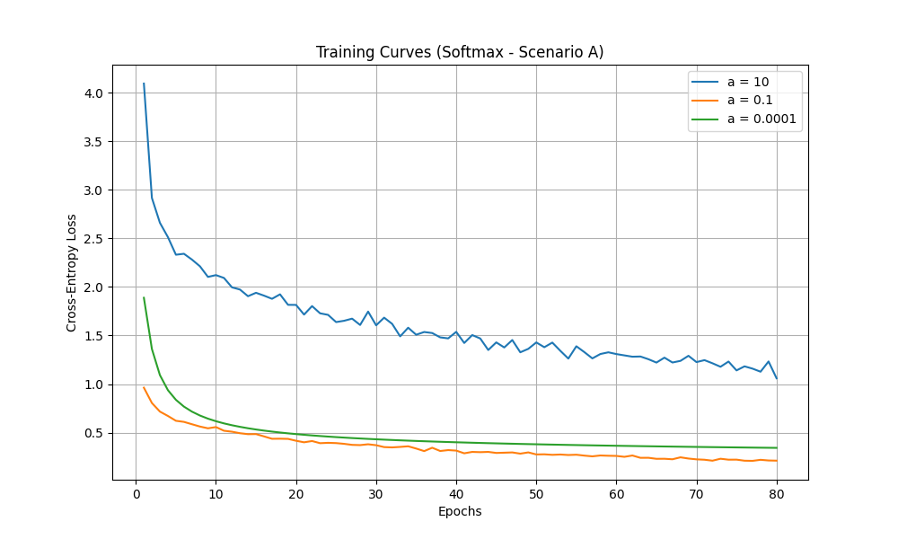
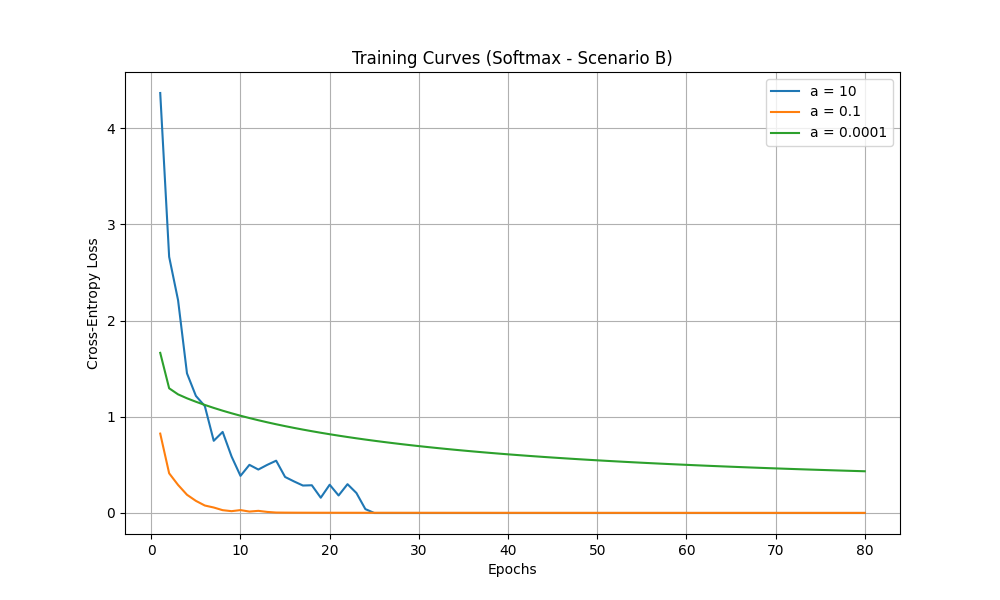
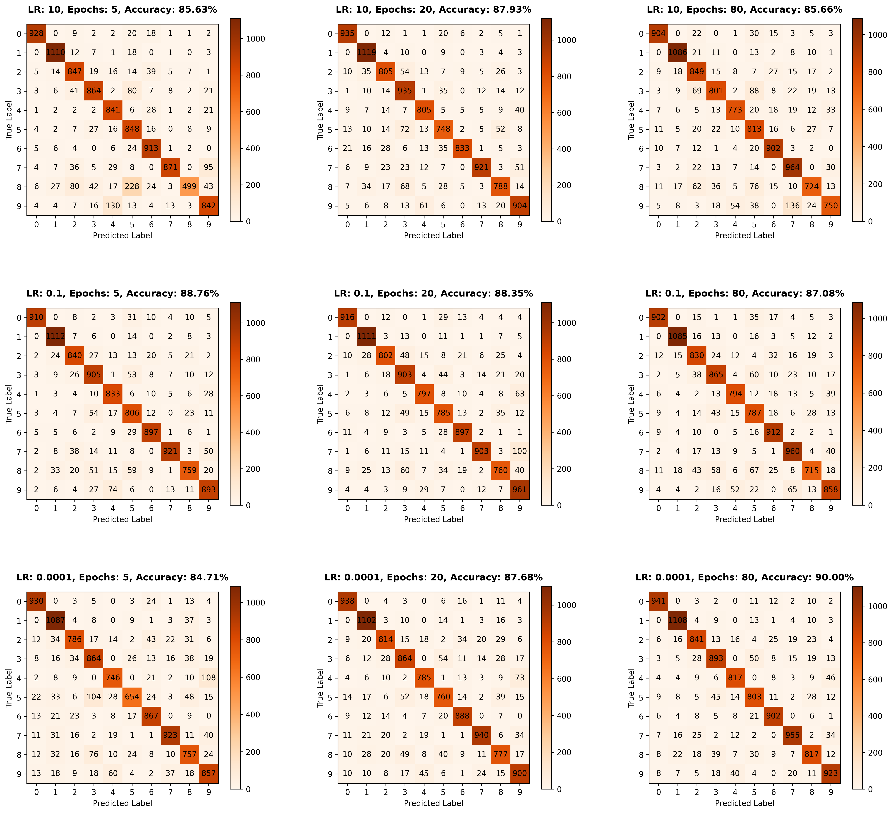
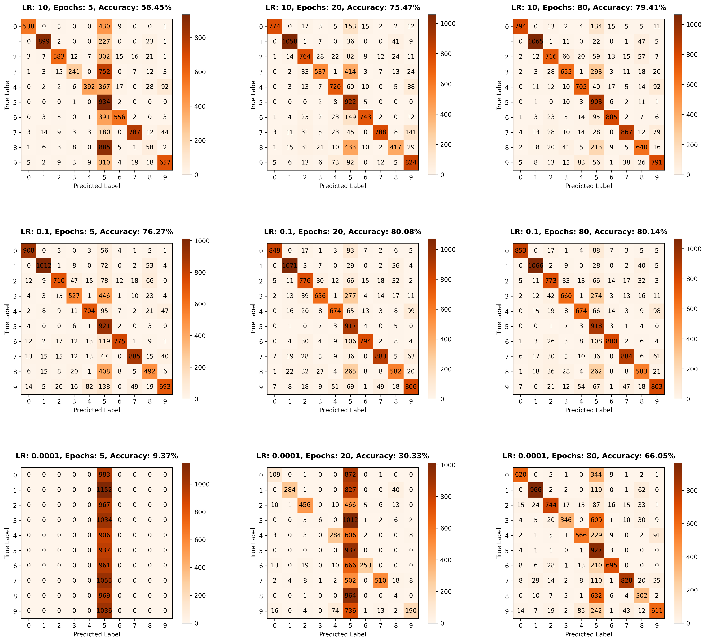

# Linear Classifiers for MNIST: Perceptron (OvO, OvA) & Softmax

This repository contains the implementation and analysis of three custom-built linear classification models from scratch to classify handwritten digits from the MNIST dataset: Perceptron (One-versus-One), Perceptron (One-versus-All), and a Linear Classifier with Softmax.

## 📄 Full Project Report
[cite_start]For a deep dive into the methodology, mathematical background, learning curves, and a detailed analysis of the misclassifications and confusion matrices, please read the **[Full Project Report (PDF)](mnist_linear_classifiers_report.pdf)**[cite: 16].

## 📌 Project Overview
The goal of this project is to implement, evaluate, and compare three multi-class linear classification models using only `numpy`.

The implemented algorithms are:
1. **Perceptron One-versus-One (OvO)** (45 binary classifiers)
2. **Perceptron One-versus-All (OvA)** (10 binary classifiers)
3. **Linear Classifier with Softmax** (Cross-Entropy Loss optimized via Stochastic Gradient Descent)

## 📊 Experimental Setup
The models were trained and evaluated under two distinct scenarios to observe how class imbalances affect linear decision boundaries:
* **Scenario A (Balanced):** 1,000 training samples per class.
* **Scenario B (Imbalanced):** 1,000 training samples for the majority class (Digit '5') and only 50 samples for each of the remaining 9 classes.

## 🧠 Algorithm Background (Theory)
<details>
<summary><b>1. Perceptron (One-versus-One & One-versus-All)</b></summary>

The Perceptron is a binary linear classifier. We extended it for multi-class classification using two heuristic strategies:
* **One-versus-One (OvO):** Trains $\frac{K(K-1)}{2}$ binary classifiers for every pair of classes (45 models for MNIST).
* **One-versus-All (OvA):** Trains $K$ binary classifiers, each separating one class from all others (10 models for MNIST).

**Update Rule:** For an input vector $x$ and true label $y \in \{-1, 1\}$, if the model predicts incorrectly ($y\cdot z\le0$), the weights $w$ and bias $b$ are updated using the learning rate $a$:
$w_{new}=w+a\cdot y\cdot x$
$b_{new}=b+a\cdot y$
</details>

<details>
<summary><b>2. Linear Classifier with Softmax</b></summary>

Unlike the Perceptron, this model inherently handles multiple classes by maintaining a single weight matrix $W$ ($10 \times 784$) and a bias vector $b$. It minimizes the Cross-Entropy Loss using Stochastic Gradient Descent.

**Softmax Probabilities (with numerical stability):**
$y_{pred\_i}=\frac{e^{z_{i}-max(z)}}{\sum_{j}e^{z_{j}-max(z)}}$

**Gradient Descent Update:**
$W_{new}=W-a\cdot outer(error,x)$ 
</details>

## 📈 Performance Summary

| Algorithm | Scenario | Best Accuracy | Epochs |
| :--- | :--- | :--- | :--- |
| **Perceptron OvO** | Scenario A (Balanced) | **91.03%** | 80 |
| **Perceptron OvA** | Scenario A (Balanced) | 86.83% | 5 |
| **Softmax** | Scenario A (Balanced) | 90.00% | 80 |
| **Perceptron OvO** | Scenario B (Imbalanced) | 82.68% | 5 |
| **Perceptron OvA** | Scenario B (Imbalanced) | 80.60% | 5 |
| **Softmax** | Scenario B (Imbalanced) | 80.14% | 80 |

## Key Insights:
* **Learning Rate Invariance:** Under zero-weight initialization, the learning rate $a$ acts merely as a scalar multiplier for the Perceptron. It changes the magnitude but not the direction of the weights, resulting in identical predictions and learning curves across all learning rates.
* **OvO vs. OvA:** The OvO strategy handles non-linearly separable datasets much better than OvA because separating just two classes at a time forms simpler geometric decision boundaries.
* **Impact of Class Imbalance:** In Scenario B, the models suffered from overfitting due to the lack of minority class samples. The Softmax classifier developed a strong probabilistic bias toward the majority class (Digit '5'), systematically predicting it during moments of uncertainty.

## 🖼️ Visual Results

### Training Curves (Softmax)
*The effect of the learning rate a on the Cross-Entropy Loss across epochs (Balanced vs. Imbalanced).*
<p align="center">
  
  
</p>

### The Impact of Imbalance (Confusion Matrices)
*Confusion matrices for Softmax showing how the model defaults to the majority class ('5') in Scenario B.*
<p align="center">
  
  
</p>

## 📁 Repository Structure
* `src/linear_classifiers.py`: The pure Python/NumPy implementation of the algorithms.
* `mnist_linear_classifiers_report.pdf`: Contains the detailed 40-page academic report.
* `images/`: Directory containing generated learning curves, confusion matrices, and classification examples.

## 🛠️ Requirements & Installation
To run the project locally, ensure you have the following Python libraries installed:
```bash
pip install numpy scikit-learn matplotlib
